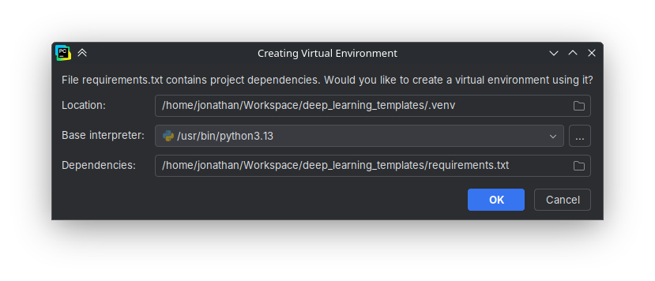
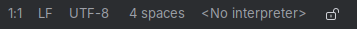
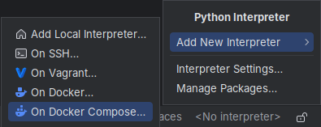
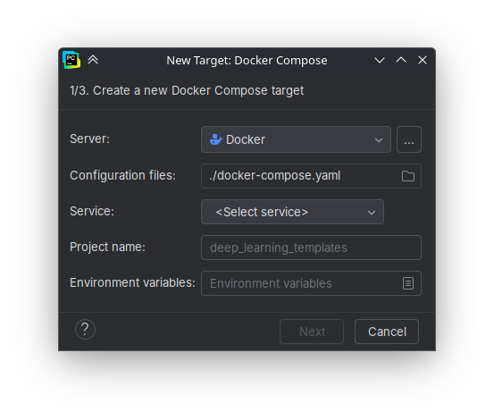
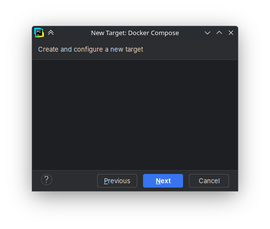
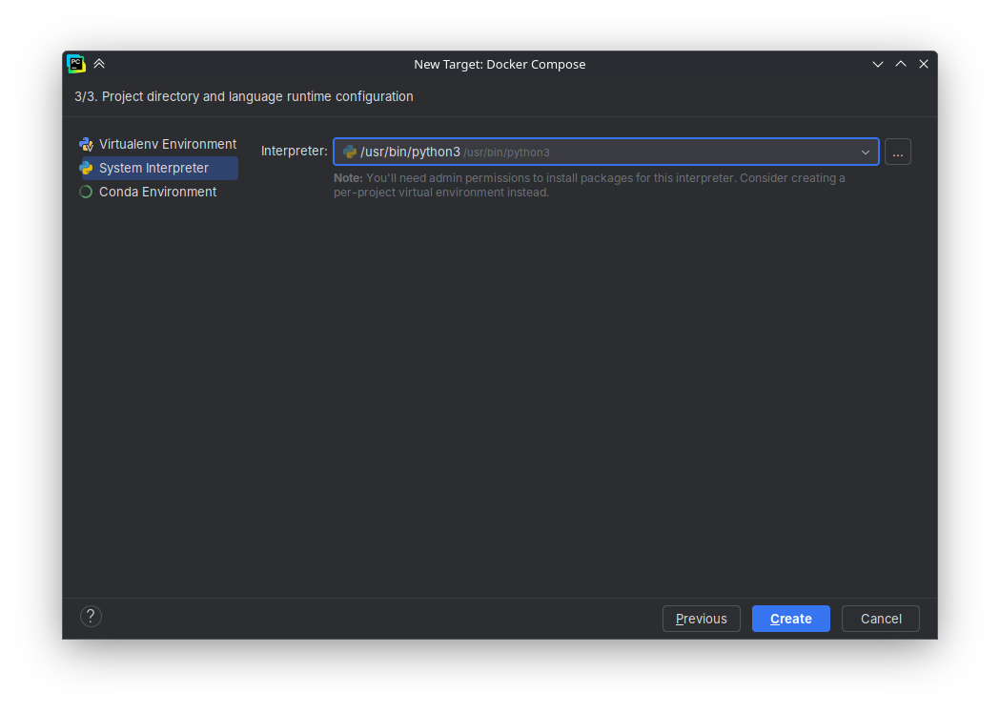

# Deep Learning Templates

This repository provides ready-to-use templates for common deep learning tasks with TensorFlow and PyTorch.
The aim is to minimize setup effort by offering a reproducible development environment through Docker Compose.
Predefined profiles let you run the same code on CPU, NVIDIA GPUs (CUDA), or AMD GPUs (ROCm), making it easy to adapt to the hardware you have available.


## 📂 Overview

The project includes folders for data, models, and notebooks, each with its own README explaining usage.  
The Docker Compose file provide pre-configured environments for different hardware setups. 


## 📚 Folder Descriptions

- `data/` \
    Contains datasets used in the notebooks and models. \
    See [`data/README.md`](data/README.md) for details.

- `models/` \
    Stores trained model files. \
    See [`models/README.md`](models/README.md) for details.

- `notebooks/` \
    Contains Jupyter notebooks for various deep learning tasks. \
    See [`notebooks/README.md`](notebooks/README.md) for details.
    
- `src/` \
    Contains Python scripts and helper utilities for the project. \
    See [`src/README.md`](src/README.md) for details.


## 🚀 Getting Started

1. **Install Docker** \
    Please follow this tutorial: https://docs.docker.com/engine/install/

2. **Clone the repository:**
    ```bash
    git clone https://github.com/JonathanWekesser/deep_learning_templates
    cd deep_learning_templates
    ```

3. **Start a Docker container:** \
    To start a container you have to build it first.
    ```bash
   ./build [cpu|nvidia|amd]
    ```
    After the container is built, you can start it.
    ```bash
   ./start [cpu|nvidia|amd]
    ```

4. **Check environment** \
    Now you can test, if your setup is working. The Jupyter Lab should work out of the box in your browser. \
    Open http://localhost:8888 and start the `gpu_benchmark.py` script to check your GPU support. 


## PyCharm Setup


If you don't want to use Jupyter in a web interface, you also can set up the Python-Interpreter of PyCharm to the docker container.

1. You have installed PyCharm. 
2. The remote interpreter is a Pro feature. To access it you either have your [free one-month Pro trial](https://www.jetbrains.com/pycharm/download/) running or you can apply for an [educational subscription](https://www.jetbrains.com/academy/student-pack/) which grants you free access JetBrains IDEs for the full duration of your studies. (This is just filling out a form, so don't worry...) 
3. Open the project in PyCharm (or clone it directly with PyCharm). 
4. When it asks you about the environment, you have to decide whether you want to run it locally or in the container.
   1. (*Recommended*) You want it to run inside the container: Skip this step and press \[Cancel\]. 
   2. You want it locally: Create your environment with \[OK\]. (You can now ignore the next steps)
   
5. After skipping the environment setup you should see a field \[\<No interpreter\>\] in the lower right corner.
    
6. Click on \[\<No interpreter\>\] and select \[Add New Interpreter\] to manually set up your interpreter to Docker. 
    Now that we have a Docker Compose environment click on \[On Docker Compose...\].

    
7. Create a new Docker Compose target.
   1. Select your Server (in the vast majority of cases \[Docker\]).
   2. Select the configuration file. This has to be './docker-compose.yaml'. 
   3. Select your Service: This depends on your system and preference. You can choose between:
      1. CPU-Version: \[dl-cpu\]
      2. Nvidia-GPU-Version: \[dl-nvidia\]
      3. AMD-GPU-Version: \[dl-amd\]
   4. You can select a custom Project name, but don't have to.
   5. There is no need for any Environment variables. 
   
   
8. Create and configure new target. 
   The prerequisite for this step is, that you have run the build script with the configuration you chose before. 
   This screen can load a little bit, so make sure you fulfilled the previous steps.
   
9. Now you can set the interpreter. Select the \[System interpreter\] (which is the system interpreter inside the container now) and use the preselected. 
   
10. 
    


## Nvidia Container Toolkit

To get access to your Nvidia GPU inside a docker container, you have to install the [Nvidia Container Toolkit](https://docs.nvidia.com/datacenter/cloud-native/container-toolkit/latest/index.html) on your host machine.  
Please follow the steps described in the guide of Nvidia: [Installation Guide](https://docs.nvidia.com/datacenter/cloud-native/container-toolkit/latest/install-guide.html#).

*Note*: Do not forget the [configuration](https://docs.nvidia.com/datacenter/cloud-native/container-toolkit/latest/install-guide.html#configuration).


## AMD ROCm 
If you have an AMD GPU, you have to do some preparations. To do so, follow this [guide](https://github.com/ROCm/ROCm-docker/blob/master/quick-start.md). 


## 🔧 Optional: Local Setup
If you prefer to run notebooks locally without Docker (which is not recommended), you can install dependencies with:
```bash
pip install -r requirements.txt
```


---
Created by Jonathan Wekesser - 2025
