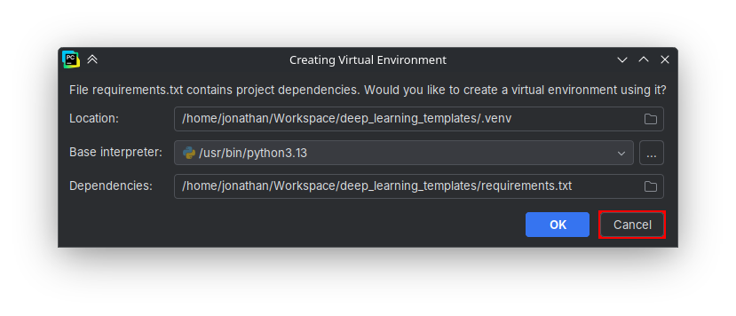
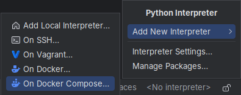
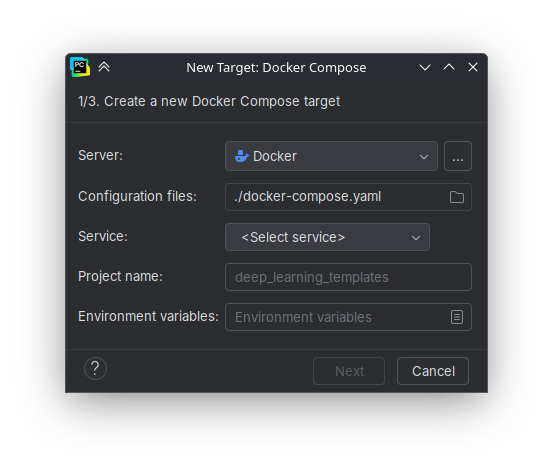
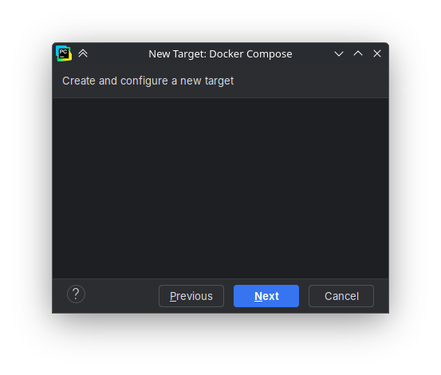
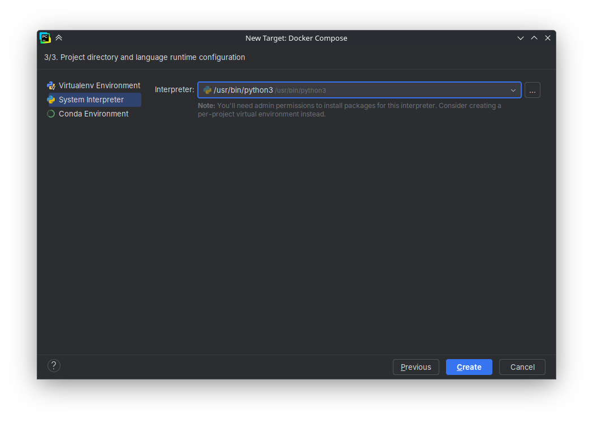
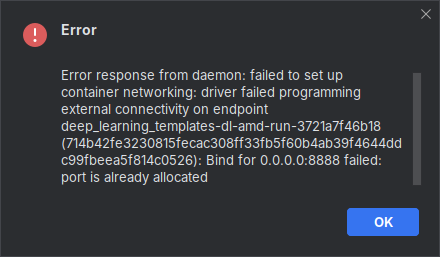
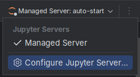
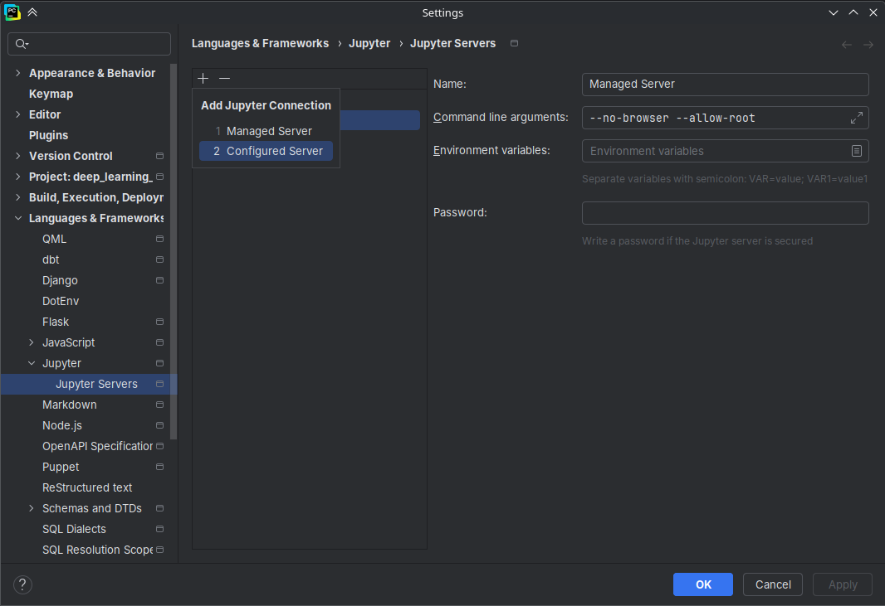

# PyCharm Setup

This guide explains how to connect your local **PyCharm IDE** with the Docker Compose environment of this repository.

## Requirements
- PyCharm **Professional Edition** or an **educational license** (free for students via [JetBrains Student Pack](https://www.jetbrains.com/academy/student-pack/))
- Docker and Docker Compose installed
- The container image must be built (but not running)

## Step-by-Step Instructions
1. Open the project in PyCharm.
2. When asked about an environment, **cancel** if you want to use the Docker container instead of a local environment.
    
3. In the lower-right corner, click **\<No interpreter\> → Add New Interpreter → On Docker Compose...** \
   
4. Select:
   - **Server:** Docker
   - **Configuration file:** `./docker-compose.yaml`  
   - **Service:** Choose one from the [container table](../README.md#containers-and-profiles)

   
   
   
   
   If an error with binding the localhost occurs, make sure your containers are stopped.
   
5. PyCharm will now build and attach to the container environment.
6. To connect Jupyter:
   - Click on the Jupyter symbol in the top-right corner and select **Configure Jupyter Server...** \
     
   - Click on the plus symbol and select **Configured Server** \
     
   - Enter:
     - Name: e.g. `TensorFlow Deep Learning Server`
     - URL: `http://localhost:8888` (for TensorFlow) or `http://localhost:8889` (for PyTorch)
     - Leave password empty (since no token is set)
     - Test and save your connection.

 Done! You can now run notebooks directly within PyCharm.

> Tip: Set up both TensorFlow and PyTorch servers once — you can easily switch between them later.
