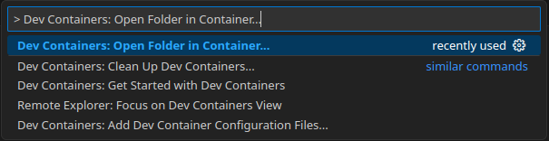
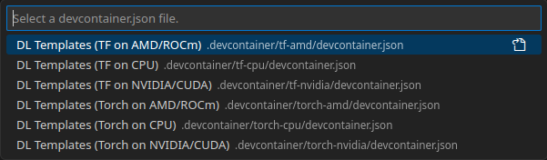
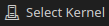
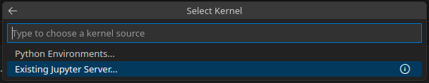
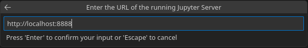
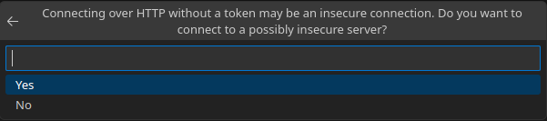
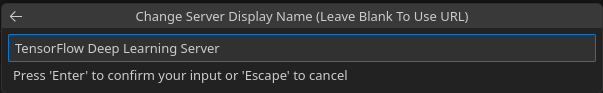
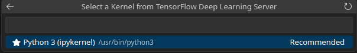

# VS Code Setup

This guide explains two ways to work with this project using **Visual Studio Code**.
Both options let you develop and run notebooks using the containerized environment defined by Docker Compose.

## Requirements

- **Visual Studio Code**
- Extensions: 
  - **Python** (ms-python.python)
  - **Jupyter** (ms-toolsai.jupyter)
  - **Dev Containers** (ms-vscode-remote.remote-containers)
  - Optional: **Docker** (ms-azuretools.vscode-docker)

  Quick Installation of extensions:  
  Open **Quick Open** in VS Code with `Ctrl + P`, then **enter each of the following commands one by one**, confirming each with **Enter** after pasting it.
  ```vscode
  ext install ms-python.python
  ```
  ```vscode
  ext install ms-toolsai.jupyter
  ```
  ```vscode
  ext install ms-vscode-remote.remote-containers
  ```
  ```vscode
  ext install ms-azuretools.vscode-docker
  ```
  You can verify successful installation by opening the Extensions view (`Ctrl + Shift + X`).

## Step-by-Step Instructions

Before opening the project in VS Code, decide which hardware profile to use (see [Containers and Profiles](../README.md#-containers-and-profiles)) and start it with the `run.sh`-script. 

After the containers are up and running, continue with the next step to open the project inside the container.

## Option 1 — Dev Container (Recommended)

The **Dev Container** setup provides the full development environment inside the Docker container.
You get the same Python interpreter, packages, and file system as used during training and experiments — directly inside VS Code.

This option is ideal if you:
- want to run scripts or notebooks with full environment parity,
- need debugging, linting, or terminal access inside the container,
- or plan to work with multiple hardware profiles (CPU / NVIDIA / AMD).

### Steps

1. **Start the desired profile (or container).**
2. **Open the project in VS Code.**
   - Open the Command Palette (`Ctrl + Shift + P`)
   - Run: **Dev Containers: Open Folder in Container...**
     
   - Select your project root folder (`deep_learning_templates`).
3. **Choose the correct configuration.**
   Select the container matching your framework and hardware setup (e.g. *TF on CPU*, *Torch on NVIDIA*, …).
   
4. **Wait for initialization.** 
   VS Code will attach to the container, install the recommended extensions, and open `/workspace` as the active folder. This may take a moment on the first start.

 **Done!** You can now start working or [set up a Jupyter Server](#jupyter-server-setup)

## Option 2 — Quick Notebook Setup (Local + Remote Jupyter)

This lightweight approach connects your local VS Code instance
to the Jupyter server running inside the Docker container.
It’s ideal if you primarily want to work in notebooks and don’t need
a full container-based interpreter for Python scripts.

### Steps

1. **Start the desired profile (or container).**
2. **Open a notebook (`.ipynb`) file** in VS Code.
3. Follow the [Jupyter Server setup](#jupyter-server-setup)

 **Done!** VS Code will now execute all notebook cells inside the container’s environment, while you edit locally.

>  **Tip:** Configure both TensorFlow and PyTorch servers once — you can easily switch between them later using the kernel selector.

## Jupyter Server setup

1. Click **Select Kernel** in the upper-right corner.

   
2. Choose **Existing Jupyter Server...**

   
3. Enter the server URL:
   1. When using **Option 1**: 
      `http://localhost:8888`: always port `8888` because it's inside the container. 
   2. When using **Option 2**:
   `http://localhost:8888` (for TensorFlow) or `http://localhost:8889` (for PyTorch)

   
4. When asked to connect to an unsecured server, click **Yes**.

   
5. Set a server name, e.g. `TensorFlow Deep Learning Server`.

   
6. Select the kernel inside the Docker container — choose the **recommended one** (marked with a ★).

   

### Note on Connecting Jupyter Servers

Each notebook must be connected to a Jupyter server once before execution.
However, once a connection has been established, VS Code remembers your servers — you can easily reconnect later without re-entering the URL or token.

>  Tip: The saved servers appear automatically in the Select Kernel menu the next time you open a notebook.

## Comparison

| Feature                       | Dev Container (Recommended) | Quick Notebook Setup      |
|-------------------------------|-----------------------------|---------------------------|
| Full container environment    | YES                         | NO (notebooks only)       |
| Run & Debug integration       | YES                         | NO                        |
| Requires Docker profile setup | (one-time)                  |                           |
| Startup speed                 | slower (initial build)      | faster (start only)       |
| Best for ...                  | Full development, debugging | Lightweight notebook work |

## Summary

- Use **Dev Containers** for a full, reproducible development experience inside Docker.
- Use **Quick Notebook Setup** if you only need to run notebooks quickly.
  Both methods use the same Docker environment and ensure consistent results across hardware profiles.
